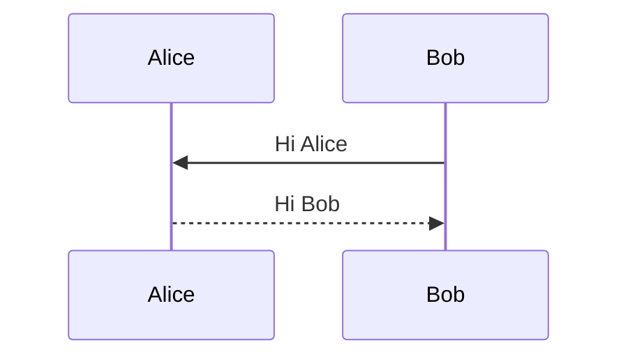

# 使用markdown管理设计文档

## 初衷
当前主流的git工具都支持在线渲染markdown，也已经支持了图语法（例如mermaid, plantuml等），但是当前主要使用的两个设计文档管理工具（内网的ClouDevOps和伙伴使用的AppStage）都存在mermaid渲染问题和svg的不兼容问题。因此，建议大家改用git同步到本地的方式进行设计文档查阅和协同编辑。

## 本地编辑工具推荐
主要推荐2个markdown编辑器（均支持windows和mac），并且都带有比较丰富的三方扩展。

1. [Visual Studio Code](https://code.visualstudio.com)，推荐插件 Markdown ALL-IN-ONE，Markdown Preview Enhanced等
2. [Obsidian](https://obsidian.md)，推荐插件 WebPage HTML Export，PlantUML等

## 设计文档中画图

1. 时序图推荐使用[mermaid语法](https://mermaid.nodejs.cn/intro/syntax-reference.html)，也可以使用[plantuml图语法](https://plantuml.com/zh)。注意：github（本站）不支持在线渲染plantuml，VSC和obsidian也默认不支持，需要安装相关插件。
2. 其他UML图（常见包括甘特图，流程图等）也都可以使用上述图语法。
3. 组网图等一些过于复杂，无法用图语法绘出的，推荐使用 [diagram.io矢量图绘图工具](https://draw.io)，可以下载windows版本或者mac版本，按需使用。

### mermaid参考样例
```code
sequenceDiagram
    participant Alice
    participant Bob
    Bob->>Alice: Hi Alice
    Alice-->>Bob: Hi Bob
```

时序图渲染效果
> github在preview界面可以正常渲染展示，但是在pages.github.com上却无法渲染（看上去是一个github的bug）。如果下面无法渲染，说明你正在使用 [github pages](https://finaliver.github.io/2024/0925_design_docs_with_md/0925_design_docs_with_md.html) 访问，请切换到 [github preview页面](https://github.com/finaliver/finaliver.github.io/blob/main/2024/0925_design_docs_with_md/0925_design_docs_with_md.md) 查看正常渲染效果。



### plantuml参考样例（github本站不支持渲染）
```code
participant Alice
participant Bob
Bob->Alice: Hi Alice
Alice-->Bob: Hi Bob
```

时序图渲染效果（github本站不支持渲染）：
```plantuml
participant Alice
participant Bob
Bob->Alice: Hi Alice
Alice-->Bob: Hi Bob
```

### svg引入参考样例

```code

```

引入效果：

